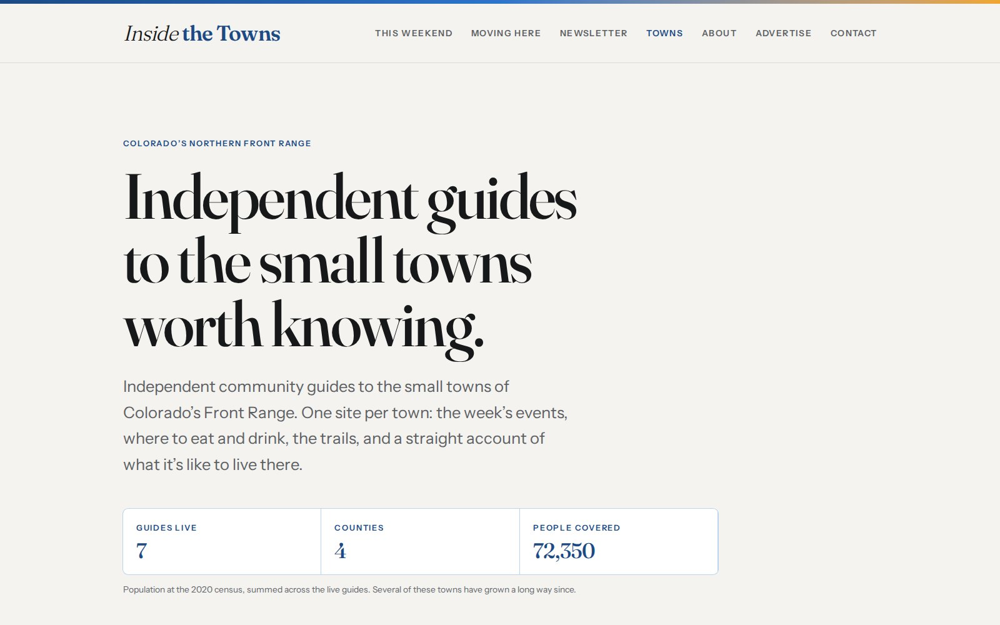
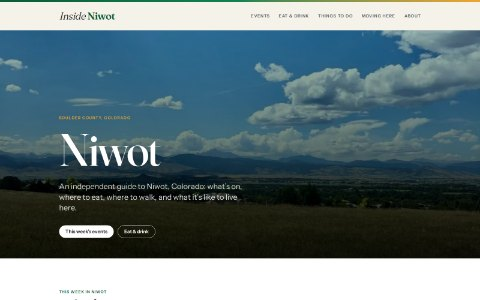

# Inside the Towns — screenshots and numbers still to fill in

Every slot below is marked in the page with a `PLACEHOLDER` comment and, where
a reader would see it, with the dashed `.cs-slot` / `.wcard__slot` treatment.
Nothing here is presented as finished work. Grep the repo for `PLACEHOLDER` to
find them all.

Screenshots come from a local build of `jlerner1965/insidethetowns`, the same
way the Niwot shots did — `TOWN=<slug> npm run build`, then
`scripts/screenshot.sh`. Site convention is 1600×1000 for desktop.

## 1. Lead image — `01-hub.jpg`

The insidethetowns.com home page at 1600×1000.

In `work/inside-the-towns/index.html`, replace the `.cs-slot` block inside
`.cs-lead` with the same `` the other case studies use:

```html

```

Then, in the same file's `<head>`, point `og:image` and `twitter:image` at
`https://lernerworks.com/case-studies/inside-the-towns/01-hub.jpg`, set
`og:image:width` / `:height` to 1600 / 1000, and rewrite `og:image:alt`. The
comment above those tags says the same thing.

## 2. Seven town thumbnails

One per town, for the cards in the network diagram. Small on the page — the
slot is 16:10 and about 240 px wide at desktop — so a home-page capture
scaled down is fine. Name them by slug:

```
niwot.jpg  lyons.jpg  berthoud.jpg  erie.jpg  johnstown.jpg  timnath.jpg  elizabeth.jpg
```

In each `.cs-net__shot`, swap the `<span>` for:

```html

```

The `.cs-net__shot` rule already sizes and crops the image; the town's paper
tint stays behind it as the ground.

## 3. Card thumbnail for the index pages — `01-hub-thumb.jpg`

`work/index.html` and `index.html` both carry a `.wcard__img--net` stand-in
built from the seven real accent colours. Once `01-hub.jpg` exists, add it to
the list in `tools/optimize-images.js`, run that to generate the 800 px
`-thumb.jpg`, and replace both `.wcard__img--net` blocks with the ordinary
`.wcard__img` + `` the other cards use.

Both copies must change together — a grep for `wcard__img--net` finds them.
When neither is left, the `.wcard__img--net`, `.wcard__net` and `.wcard__slot`
rules at the end of `assets/site.css` can go too.

## 4. Traffic and usage

The `.cs-slot` under "Result" in the case study. Fill it from the analytics the
network actually runs, with the date range and the source stated, the way
`/work/lernerworks/` quotes its own measurements. Do not estimate: everything
else on that page can be counted from the repository, and an unsourced traffic
figure would be the only claim on it a reader cannot check.

## 5. The Black Hawk domain

The scaling section names Black Hawk as a held domain but does not give the
domain, because it is not in the `insidethetowns` repo the way
`carbonvalleyguide.com` is (`PLAN.md`, wave 8). Set the exact domain there, or
drop the mention.

## After filling any of these

```sh
node tools/optimize-images.js            # re-encode, regenerate -thumb.jpg
python3 tools/set-image-dims.py --write  # write real pixel dimensions into the HTML
```

and tick the matching line in the root `README.md` launch checklist.
